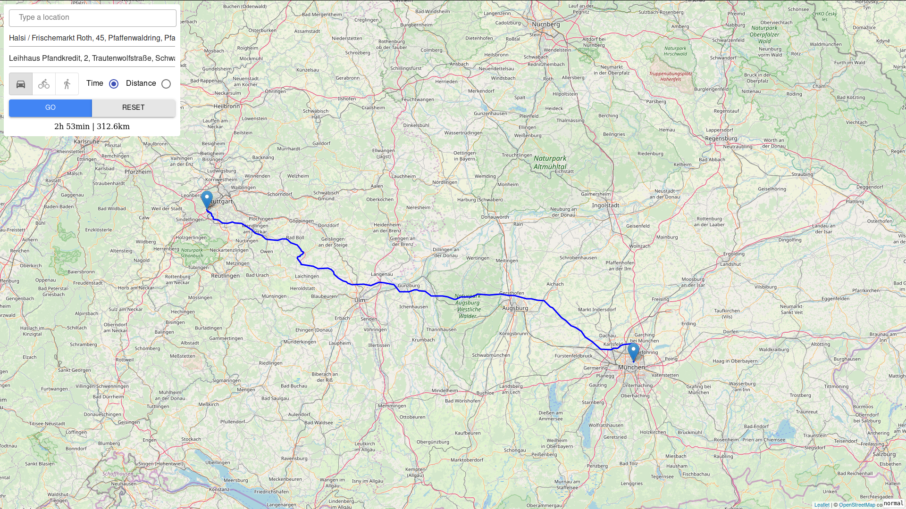

    </img>

# eMaps

Routing planner for electrically-powered vehicles, such as eCars or eBikes, based on OpenStreetMap data.

## Documentation
Visit the [doc](doc) folder for further documentation, i.e. a presentation and a paper about this project.

## Dependencies

- [Rust + Cargo](https://rustup.rs/)
- [Node.js + NPM](https://nodejs.org/de/download/package-manager/)

## Compile

### Ubuntu 19.10
Run the bash script in the project root via `sudo ./build.sh`.
This also installs the necessary dependencies.

### Other
Run `make` in project root.

## Run

1. Run the executable in the project root and provide a *.osm.pbf file as argument, e.g. via `./maps germany-latest.osm.pbf`
2. Open [http://localhost:8000/](http://localhost:8000/) in the browser.

The first run will parse the provided *.osm.pbf file and save the result as binary.
Subsequent runs will only load the precomputed binary.

## Run Dev Mode

1. Execute `cargo run` in the backend folder root and provide a *.osm.pbf file as argument, e.g. `cargo run target/germany-latest.osm.pbf`
2. Run `npm start` in the frontend folder root.
3. Open [http://localhost:3000/](http://localhost:3000/) in the browser.

The first run will parse the provided *.osm.pbf file and save the result as binary.
Subsequent runs will only load the precomputed binary.

## Usage

1. Select transportation mode (car/bike)
2. Select shortest path by travel time or travel distance
3. Enter current range and maximum range in kilometres (fully charged) of your e-Vehicle. Please make sure to enter reasonable values for the ranges.
3. Set start and goal via the search box or by left-clicking on map
4. Click "Go"
5. If a new route should be computed, click "Reset" or right-click on the map to reset
6. To display all available charging stations, click "Show Charging Stations", and to hide them "Hide Charging Stations".
