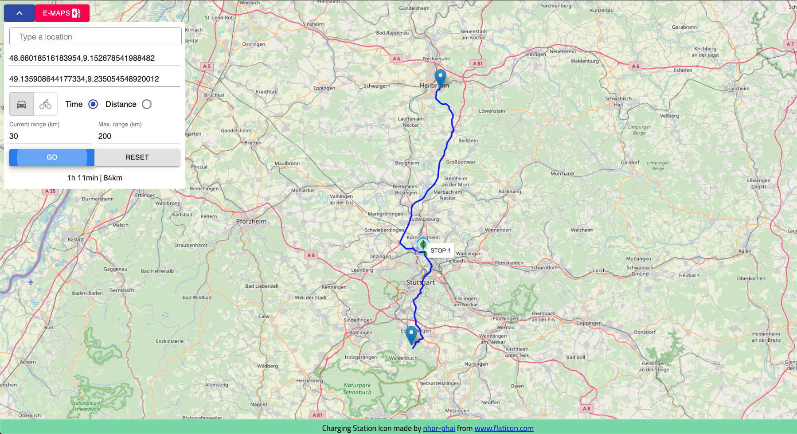

    </img>

# eMaps

## Dependencies

- [Rust + Cargo](https://rustup.rs/)
- [Node.js + NPM](https://nodejs.org/de/download/package-manager/)

## Compile

### Ubuntu 19.10
Run the bash script in the project root via `sudo ./build.sh`.
This also installs the necessary dependencies.

### Other
Run `make` in project root.

## Run

1. Run the executable in the project root and provide a *.osm.pbf file as argument, e.g. via `./maps germany-latest.osm.pbf`
2. Open [http://localhost:8000/](http://localhost:8000/) in the browser.

The first run will parse the provided *.osm.pbf file and save the result as binary.
Subsequent runs will only load the precomputed binary.

## Usage

1. Select transportation (car/bike)
2. Select shortest path by travel time or travel distance
3. Enter current range and maximum range (fully charged) of your e-Vehicle 
3. Set start and goal via the search box or by left-clicking on map
4. Click "Go"
5. If a new route should be computed, click "Reset" or right-click on the map to reset
